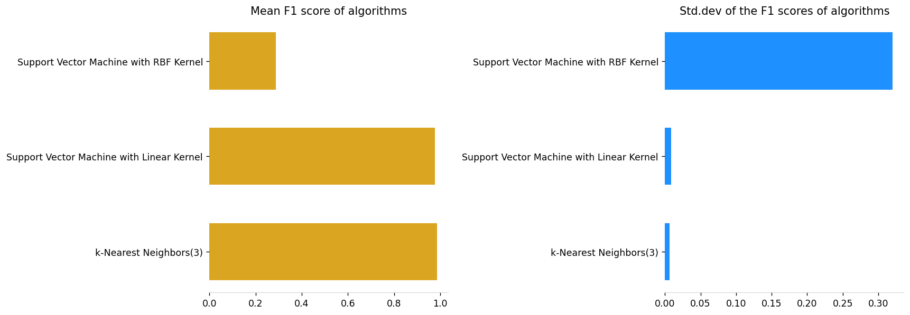
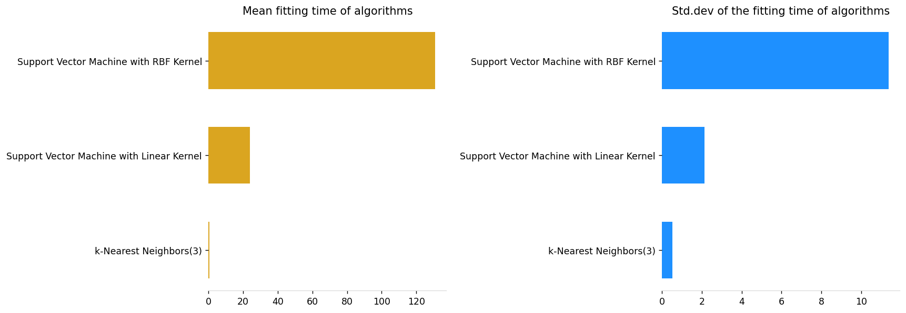
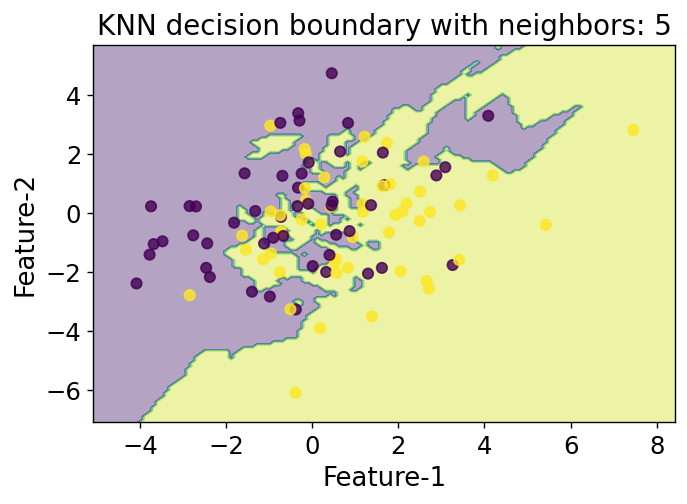

# `mldsutils`: A machine-learning and data science utility package


## Install

`pip install mldsutils`

## How to use `mldsutils.mldsutils`

- Import the library
- Define a list of Scikit-learn estimators with your choice of hyperparameters
- Generate some synthetic data
- Run the `run_regressor` function to iterate through each of them and evaluate the given datatset

### Import

```python
from mldsutils.mldsutils import *
import numpy as np
from sklearn.neighbors import KNeighborsClassifier
from sklearn.svm import SVC
from sklearn.datasets import make_classification
```

### Classifiers and their names

```python
classifiers = [KNeighborsClassifier(3),
               SVC(kernel="linear", C=0.025),
               SVC(gamma=2, C=10),]

clf_names = ['k-Nearest Neighbors(3)',
             'Support Vector Machine with Linear Kernel',
            'Support Vector Machine with RBF Kernel']
```

### Some data

```python
X1, y1 = make_classification(n_features=20, n_samples=2000,n_redundant=0, n_informative=20,
                             n_clusters_per_class=1,class_sep=0.5)
```

### Run
Note, you will get back a Pandas DataFrame from this

```python
d1,d2 = run_classifiers(X1,y1,
                        clf_lst=classifiers,names = clf_names,
                        runtime=True,
                        metric='f1',verbose=True)
```

    Finished 10 runs for k-Nearest Neighbors(3) algorithm
    ---------------------------------------------------------------------------
    Finished 10 runs for Support Vector Machine with Linear Kernel algorithm
    ---------------------------------------------------------------------------
    Finished 10 runs for Support Vector Machine with RBF Kernel algorithm
    ---------------------------------------------------------------------------
    

## Examining the result

### Checking the dataframe of F1-scores

```python
d1
```
<table border="1" class="dataframe">
  <thead>
    <tr style="text-align: right;">
      <th></th>
      <th>k-Nearest Neighbors(3)</th>
      <th>Support Vector Machine with Linear Kernel</th>
      <th>Support Vector Machine with RBF Kernel</th>
    </tr>
  </thead>
  <tbody>
    <tr>
      <th>0</th>
      <td>0.944724</td>
      <td>0.861314</td>
      <td>0.000000</td>
    </tr>
    <tr>
      <th>1</th>
      <td>0.968215</td>
      <td>0.855746</td>
      <td>0.641766</td>
    </tr>
    <tr>
      <th>2</th>
      <td>0.946292</td>
      <td>0.863850</td>
      <td>0.289474</td>
    </tr>
    <tr>
      <th>3</th>
      <td>0.967742</td>
      <td>0.856481</td>
      <td>0.000000</td>
    </tr>
    <tr>
      <th>4</th>
      <td>0.969849</td>
      <td>0.865116</td>
      <td>0.020202</td>
    </tr>
    <tr>
      <th>5</th>
      <td>0.966234</td>
      <td>0.875912</td>
      <td>0.000000</td>
    </tr>
    <tr>
      <th>6</th>
      <td>0.967581</td>
      <td>0.868545</td>
      <td>0.000000</td>
    </tr>
    <tr>
      <th>7</th>
      <td>0.957179</td>
      <td>0.852381</td>
      <td>0.000000</td>
    </tr>
    <tr>
      <th>8</th>
      <td>0.962791</td>
      <td>0.871194</td>
      <td>0.000000</td>
    </tr>
    <tr>
      <th>9</th>
      <td>0.948980</td>
      <td>0.897959</td>
      <td>0.010204</td>
    </tr>
  </tbody>
</table>
</div>


### Stats of the `d1` to compare algorithms

```python
d1.describe().T
```

<table border="1" class="dataframe">
  <thead>
    <tr style="text-align: right;">
      <th></th>
      <th>count</th>
      <th>mean</th>
      <th>std</th>
      <th>min</th>
      <th>25%</th>
      <th>50%</th>
      <th>75%</th>
      <th>max</th>
    </tr>
  </thead>
  <tbody>
    <tr>
      <th>k-Nearest Neighbors(3)</th>
      <td>10.0</td>
      <td>0.959959</td>
      <td>0.009884</td>
      <td>0.944724</td>
      <td>0.951029</td>
      <td>0.964512</td>
      <td>0.967702</td>
      <td>0.969849</td>
    </tr>
    <tr>
      <th>Support Vector Machine with Linear Kernel</th>
      <td>10.0</td>
      <td>0.866850</td>
      <td>0.013142</td>
      <td>0.852381</td>
      <td>0.857690</td>
      <td>0.864483</td>
      <td>0.870532</td>
      <td>0.897959</td>
    </tr>
    <tr>
      <th>Support Vector Machine with RBF Kernel</th>
      <td>10.0</td>
      <td>0.096165</td>
      <td>0.211790</td>
      <td>0.000000</td>
      <td>0.000000</td>
      <td>0.000000</td>
      <td>0.017703</td>
      <td>0.641766</td>
    </tr>
  </tbody>
</table>
</div>


### Checking the dataframe of fitting/training time

```python
d2
```
<table border="1" class="dataframe">
  <thead>
    <tr style="text-align: right;">
      <th></th>
      <th>k-Nearest Neighbors(3)</th>
      <th>Support Vector Machine with Linear Kernel</th>
      <th>Support Vector Machine with RBF Kernel</th>
    </tr>
  </thead>
  <tbody>
    <tr>
      <th>0</th>
      <td>0.979</td>
      <td>43.942</td>
      <td>124.595</td>
    </tr>
    <tr>
      <th>1</th>
      <td>0.000</td>
      <td>45.477</td>
      <td>137.699</td>
    </tr>
    <tr>
      <th>2</th>
      <td>0.000</td>
      <td>45.893</td>
      <td>107.373</td>
    </tr>
    <tr>
      <th>3</th>
      <td>0.981</td>
      <td>49.376</td>
      <td>141.589</td>
    </tr>
    <tr>
      <th>4</th>
      <td>0.000</td>
      <td>44.429</td>
      <td>148.940</td>
    </tr>
    <tr>
      <th>5</th>
      <td>0.976</td>
      <td>43.940</td>
      <td>147.467</td>
    </tr>
    <tr>
      <th>6</th>
      <td>0.977</td>
      <td>42.083</td>
      <td>134.906</td>
    </tr>
    <tr>
      <th>7</th>
      <td>0.974</td>
      <td>46.962</td>
      <td>139.639</td>
    </tr>
    <tr>
      <th>8</th>
      <td>0.000</td>
      <td>42.484</td>
      <td>130.852</td>
    </tr>
    <tr>
      <th>9</th>
      <td>0.976</td>
      <td>61.050</td>
      <td>113.273</td>
    </tr>
  </tbody>
</table>
</div>


```python
d2.describe().T
```

<table border="1" class="dataframe">
  <thead>
    <tr style="text-align: right;">
      <th></th>
      <th>count</th>
      <th>mean</th>
      <th>std</th>
      <th>min</th>
      <th>25%</th>
      <th>50%</th>
      <th>75%</th>
      <th>max</th>
    </tr>
  </thead>
  <tbody>
    <tr>
      <th>k-Nearest Neighbors(3)</th>
      <td>10.0</td>
      <td>0.5863</td>
      <td>0.504610</td>
      <td>0.000</td>
      <td>0.00000</td>
      <td>0.9750</td>
      <td>0.97675</td>
      <td>0.981</td>
    </tr>
    <tr>
      <th>Support Vector Machine with Linear Kernel</th>
      <td>10.0</td>
      <td>46.5636</td>
      <td>5.523546</td>
      <td>42.083</td>
      <td>43.94050</td>
      <td>44.9530</td>
      <td>46.69475</td>
      <td>61.050</td>
    </tr>
    <tr>
      <th>Support Vector Machine with RBF Kernel</th>
      <td>10.0</td>
      <td>132.6333</td>
      <td>13.851391</td>
      <td>107.373</td>
      <td>126.15925</td>
      <td>136.3025</td>
      <td>141.10150</td>
      <td>148.940</td>
    </tr>
  </tbody>
</table>
</div>


## Visualizing the results with the `plot_bars` function

Make sure to pass the correct titles of the plots. Otherwise, default strings will be plotted which may indicate wrong thing for your experiment.

```python
plot_bars(d1,t1="Mean F1 score of algorithms",
              t2="Std.dev of the F1 scores of algorithms")
```





```python
plot_bars(d2,t1="Mean fitting time of algorithms",
              t2="Std.dev of the fitting time of algorithms")
```





## How to use `mldsutils.plots`

```python
from sklearn.neighbors import KNeighborsClassifier
from sklearn.datasets import make_classification
import matplotlib.pyplot as plt
from mldsutils.plots import *
        
X1, y1 = make_classification(n_features=10, n_samples=100,
                                     n_redundant=0, n_informative=10,
                                     n_clusters_per_class=1,class_sep=0.5)

plot_decision_boundaries(X1,y1,KNeighborsClassifier,n_neighbors=5)
plt.show()
```




